# Geohash_Thesis

This repo will provide a detailed implementation of the geohashing system. This includes encoding and decoding geohashes, along with a function designed to identify nearby locations based on the geohashes.

# GeoHash Utilities

## Overview

This module provides utilities for working with geohashes. Geohashing encodes geographic coordinates (latitude and longitude) into a concise string.

## Functions

### 1. encode

Encodes a latitude and longitude into a geohash string.

- **Parameters**: `lat`, `lon`, `precision` (optional)
- **Returns**: Geohash string

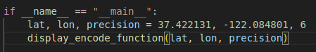
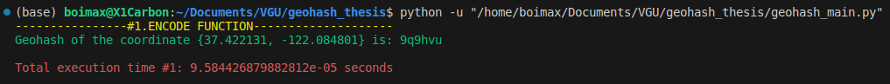

### 2. decode

Decodes a geohash into its approximate central point.

- **Parameters**: `geohash`
- **Returns**: Dictionary with latitude and longitude

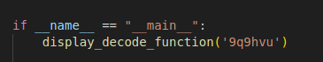
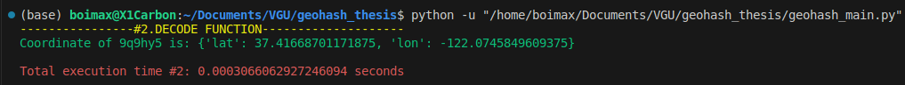

### 3. get_nearby_geohashes

Calculates geohashes within a specified radius from a point.

- **Parameters**: `latitude`, `longitude`, `radius`, `precision`
- **Returns**: List of geohashes

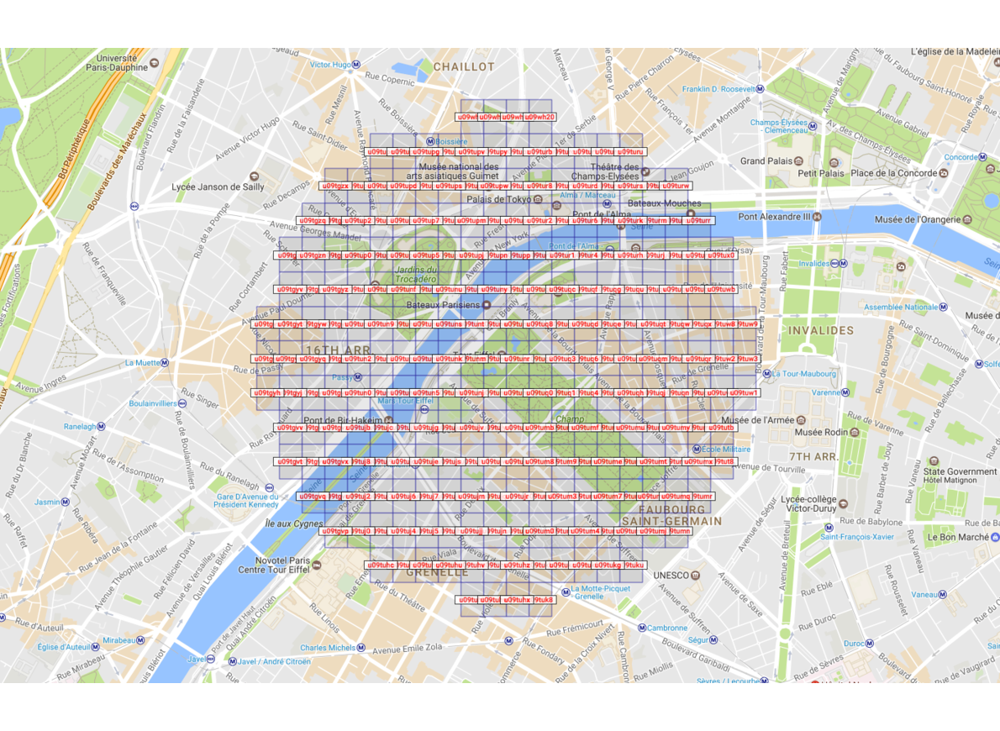
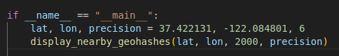
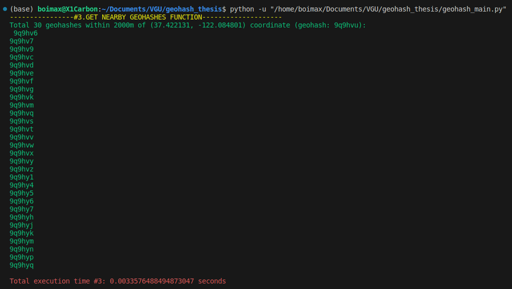

### 4. geohash_distance

Computes the distance between two geohashes.

- **Parameters**: `geohash1`, `geohash2`

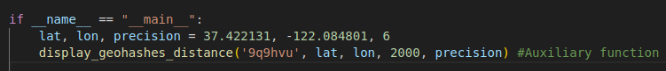
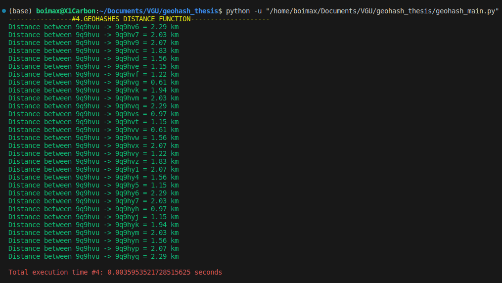

### 5. generate_locations_data

Produces mock location data around a central point.

- **Parameters**: `size`, `central_lat`, `central_lon`, `precision`
- **Returns**: List of mock locations

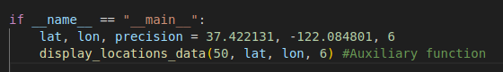
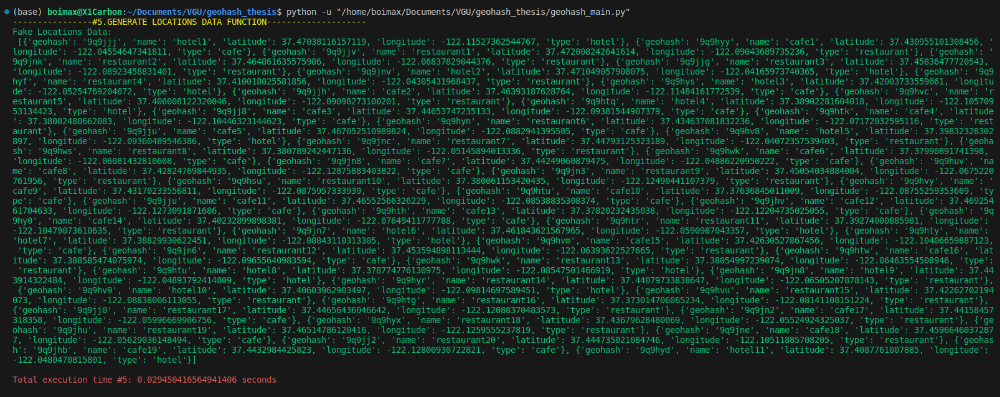

### 6. get_nearby_locations

Retrieves locations within a specified radius from a point.

- **Parameters**: `lat`, `lon`, `radius`, `precision`, `locations_data`, `location_type` (optional)
- **Returns**: List of nearby locations

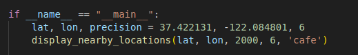


## Dependencies

- `math`
- `time`
- `argparse`
- `clint.textui`
- `random`
- `faker`

## Usage

Execute this module by running the command below in your terminal:

```bash
python <module_name>.py
```
